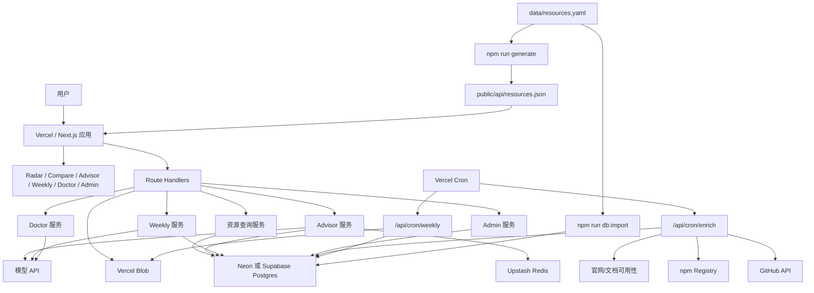

# 小程序雷达完整实施总方案

本文档用于指导 `wechat-miniapp-radar` 向“小程序雷达”的完整改造、上线和运营。它把产品定位、技术架构、Vercel 部署、数据存储、AI 能力、实施阶段和验收标准放在同一套执行框架里。

相关文档：

- 文档索引：[README.md](./README.md)
- 产品方案：[miniprogram-radar-product.md](./miniprogram-radar-product.md)
- Vercel 生产方案：[miniprogram-radar-vercel-production-plan.md](./miniprogram-radar-vercel-production-plan.md)
- 实施追踪表：[miniprogram-radar-implementation-tracker.md](./miniprogram-radar-implementation-tracker.md)

## 1. 总目标

把当前资源收集型项目改造成一个原创性的 AI 工具产品：

> 小程序雷达：AI 辅助的小程序生态选型、风险评估、项目体检和生态追踪工具。

最终产品不再以“链接收集”为核心，而是围绕这些问题提供判断：

- 现在做微信小程序，哪些框架、组件库、SDK 和工具值得选？
- Taro、uni-app、原生小程序、MPX、WePY、mpvue 应该怎么比较？
- 某个资源是否还维护，风险在哪里，替代方案是什么？
- 一个已有小程序项目是否存在停维框架、风险依赖、配置或密钥风险？
- 小程序生态最近有哪些重要更新、风险变化和新工具？

## 2. 产品范围

首版需要形成 6 个核心模块。

| 模块 | 目标 | 首版能力 |
| --- | --- | --- |
| Radar | 小程序生态技术雷达 | 资源搜索、筛选、推荐状态、风险等级、维护状态、替代方案、证据来源 |
| Compare | 技术方案对比 | 对比 Taro、uni-app、原生小程序、MPX、WePY、mpvue 等核心方案 |
| Advisor | AI 选型顾问 | 根据团队背景、业务场景和约束生成选型建议；无 AI Key 时规则兜底 |
| Doctor | 小程序项目体检 | CLI 和 Web 入口扫描项目结构、框架、依赖、配置和密钥风险 |
| Weekly | 生态周报 | 基于采集信号生成 Markdown、JSON、RSS 和历史周报 |
| Admin | 运维后台 | 查看健康状态、集成状态、运行日志，维护资源状态和风险字段 |

MVP 暂缓内容：

- 用户登录、收藏、订阅和团队空间。
- 付费报告和商业化能力。
- 多租户权限系统。
- 大规模爬虫和实时监控。
- 支付宝、抖音、百度等其他小程序平台的完整覆盖。

### 2.1 当前交付状态

当前仓库已经从 awesome 列表改造成“小程序雷达”的产品骨架，具备本地可运行、静态降级、数据库优先、规则 AI 兜底和 Vercel 部署检查能力。生产环境是否完成，取决于 Vercel 项目、数据库、Redis、Blob、Cron、Admin Token 和可选 AI Key 是否已经真实配置并验证。

| 能力 | 当前状态 | 说明 |
| --- | --- | --- |
| 产品页面 | 已实现 | 首页、Radar、详情、Compare、Advisor、Weekly、Doctor、Admin |
| 资源数据 | 已实现 | `data/resources.yaml`、静态 JSON、数据库导入链路 |
| 数据库 | 已实现代码，待生产接入 | Drizzle schema、迁移、导入、验证脚本已具备 |
| AI 能力 | 规则兜底已实现，真实模型待确认 | 未经用户确认前不配置或调用真实 AI |
| Cron | 已实现代码，待生产接入 | Enrich 和 Weekly Cron 已有鉴权和 dry-run 验证 |
| Redis/KV | 已实现降级路径，待生产接入 | 用于缓存、限流、任务锁 |
| Blob | 已实现降级路径，待生产接入 | 用于周报、Doctor 报告和导出快照 |
| Admin | 已实现 | Admin API、资源维护、生产就绪 API 均需 `ADMIN_TOKEN` |
| 验证脚本 | 已实现 | `check`、`smoke`、`deploy:check`、`deployment:verify`、`production:bootstrap` |

### 2.2 首版页面与 API 对照

| 产品能力 | 页面 | API / 脚本 | 验收重点 |
| --- | --- | --- | --- |
| Radar | `/radar` | `/api/resources`、`npm run resources` | 搜索、筛选、分页、静态降级 |
| Detail | `/resources/[id]` | `/api/resources/[id]` | 摘要、证据、评分、替代方案、更新时间线 |
| Compare | `/compare` | `/api/compare`、`npm run compare` | 核心框架横向对比、场景化建议 |
| Advisor | `/advisor` | `/api/advisor`、`npm run advisor` | 规则兜底、缓存、限流、证据引用 |
| Weekly | `/weekly`、`/weekly.xml` | `/api/weekly`、`npm run weekly` | 周报、RSS、历史快照 |
| Doctor | `/doctor` | `npx miniprogram-radar doctor`、`npm run doctor` | 项目识别、风险扫描、修复建议 |
| Admin | `/admin` | `/api/admin/*`、`/api/admin/readiness` | 鉴权、健康状态、集成状态、运行日志 |
| Cron | 无公开页面 | `/api/cron/enrich`、`/api/cron/weekly` | 未授权 401、授权 dry-run、任务锁 |
| 健康检查 | 无公开页面 | `/api/health`、`npm run health` | 环境、数据库、Blob、Redis、AI 配置状态 |

## 3. 技术选型

固定主栈：

| 层级 | 选型 | 用途 |
| --- | --- | --- |
| Web 框架 | Next.js App Router | 页面、API、Cron 入口和服务端逻辑 |
| 语言 | TypeScript | 数据模型、页面、API、脚本和测试 |
| 样式 | Tailwind CSS | 雷达页、详情页、后台、表单和响应式布局 |
| UI | shadcn 风格组件 | Card、Badge、Button、Table、Dialog、Tabs、Command、Form |
| 图标 | lucide-react | 导航、状态、操作按钮 |
| 部署 | Vercel | Production、Preview、Functions、Cron、Analytics、Speed Insights |
| ORM | Drizzle ORM | Postgres schema、迁移、类型安全查询 |
| 主数据库 | Neon Postgres 或 Supabase Postgres | 资源、采集信号、评分、AI 摘要、周报、日志 |
| 缓存/限流 | Upstash Redis | Advisor 缓存、IP 限流、Cron 任务锁 |
| 对象存储 | Vercel Blob | 周报快照、Doctor 报告、导出文件 |
| AI | 服务端模型 API | 摘要、问答、风险解释、周报导语、体检总结 |

数据库默认建议：

- 默认选择 Neon Postgres：最贴合 `Drizzle + Postgres + Vercel` 的 MVP 路线。
- 如果后续需要 Auth、Storage、管理后台和用户系统，优先评估 Supabase。
- 如果追求更高免费读写额度，并接受 SQLite/libSQL，可评估 Turso，但不作为当前默认路线。

## 4. 总体架构



降级策略：

- 无数据库：页面和 API 读取静态 JSON。
- 无 AI Key：Advisor、AI 摘要、Weekly、Doctor 使用规则结果。
- 无 Redis：使用内存限流，不做分布式任务锁。
- 无 Blob：周报、导出和 Doctor 报告直接返回内容或写数据库索引。
- Cron 未配置：用 npm 脚本手动运行采集和周报。

## 5. 数据实施方案

保留 `data/resources.yaml` 作为人工维护入口和静态降级数据源；Postgres 作为线上主数据源。

核心表：

| 表 | 用途 |
| --- | --- |
| `resources` | 资源基础信息、分类、URL、摘要、状态、风险、适用场景 |
| `resource_signals` | GitHub、npm、官网、文档等采集信号 |
| `resource_scores` | 规则评分、推荐状态、风险等级、评分理由 |
| `resource_ai_summaries` | 规则或模型生成摘要、风险说明、证据引用 |
| `resource_alternatives` | 替代方案、迁移建议、同类资源关系 |
| `advisor_sessions` | Advisor 问题、上下文、回答摘要、命中资源 |
| `weekly_reports` | 周报周期、摘要、结构化内容、Markdown、Blob URL |
| `operation_logs` | Cron、Admin、Weekly、采集和导入运行记录 |

资源判断字段：

| 字段 | 枚举 | 含义 |
| --- | --- | --- |
| `status` | `adopt` | 推荐新项目采用 |
| `status` | `trial` | 可以试用，适合特定场景 |
| `status` | `assess` | 需要谨慎评估后使用 |
| `status` | `hold` | 不建议新项目使用，主要用于老项目维护或迁移参考 |
| `riskLevel` | `low` / `medium` / `high` | 风险等级 |
| `maintainStatus` | `active` / `low` / `stopped` / `unknown` | 维护状态 |

数据流：

1. 人工维护 `data/resources.yaml`。
2. `npm run generate` 生成 README 和 `public/api/resources.json`。
3. `npm run db:migrate` 建表。
4. `npm run db:import` 将 YAML 幂等导入数据库。
5. 页面和 API 优先读数据库，数据库缺失时回退静态 JSON。
6. Cron 采集 GitHub、npm、官网和文档信号。
7. 评分任务根据采集信号生成推荐状态、风险等级和理由。
8. AI 摘要、Advisor、Weekly、Doctor 结果按需写数据库、Redis 或 Blob。

## 6. AI 实施方案

AI 只做增强，不做事实来源。所有 AI 结论必须绑定已有资源、采集信号或证据 URL。

### 6.1 无 Key 可用

没有 `OPENAI_API_KEY` 时仍要可用：

- Radar 正常筛选和展示。
- Compare 返回规则型对比。
- Advisor 返回规则型选型建议。
- Weekly 用结构化信号生成周报。
- Doctor 用扫描规则生成报告。

### 6.2 有 Key 增强

用户确认配置 `OPENAI_API_KEY` 后再启用真实模型：

- 资源摘要：生成一句话定位、适用场景、风险说明。
- Advisor：根据团队背景、业务目标、候选资源和证据生成建议。
- Weekly：生成周报导语、变化解读和风险提示。
- Doctor：把扫描结果转成更清晰的迁移和修复建议。

强约束：

- 模型调用只在服务端 Route Handler 或脚本中发生。
- 不允许创建 `NEXT_PUBLIC_OPENAI_API_KEY`。
- 输出必须包含资源引用或证据引用。
- 引用 URL 必须来自资源库或证据字段。
- 校验失败不写数据库、不写 Blob、不进入公开页面。
- 相同资源摘要、相同 Advisor 问题和周报按周期缓存。

## 7. Vercel 与免费资源策略

MVP 的主要访问模式是公开页面浏览、少量 API 查询、每日采集、每周周报和少量 Advisor 问答。Vercel Hobby 免费资源整体够用，主要约束在 AI 成本、数据库容量、Blob 操作数、Redis 命令数和 Cron 耗时。

建议使用的 Vercel 能力：

| 能力 | 用途 | 判断 |
| --- | --- | --- |
| Production / Preview Deployments | 生产站点和每次提交预览 | 必用 |
| CDN / ISR | 缓存 Radar、详情页、周报页 | 必用 |
| Functions / Route Handlers | API、Advisor、Doctor、Admin、Cron | 必用 |
| Vercel Cron | 每日采集、每周周报 | 可用，按低频设计 |
| Analytics | 看热门页面、资源、入口 | 建议使用 |
| Speed Insights | 观察页面性能 | 建议使用 |
| Vercel Blob | 周报、Doctor 报告、资源导出快照 | 建议使用 |
| Edge Config | 功能开关、公告、模型开关 | 可选 |
| Firewall / Rate Limiting | 保护 Advisor、Admin、Cron | 可评估，MVP 先用应用层限流 |
| Marketplace | Neon、Supabase、Upstash 等托管服务 | 必用 |

免费额度控制策略：

- 公开页面尽量静态化或 ISR。
- `/api/resources` 默认分页，只返回摘要字段。
- 详情页再取完整证据、评分和替代方案。
- Cron 分批采集，避免一次抓取全部资源。
- Advisor 必须缓存和限流。
- 周报和 Doctor 报告放 Blob，数据库只存 URL、hash 和元数据。
- `operation_logs` 默认保留 30 天。
- AI token 费用不属于 Vercel 免费资源，必须单独控量。

## 8. 实施阶段

### 阶段 0：基线冻结

目标：确保当前仓库在无外部服务时也能运行。

任务：

- 固化 Next.js、Tailwind CSS、shadcn 风格组件、Drizzle、Vercel 配置。
- 确认静态 JSON、数据库优先读取、规则 AI 三条链路。
- 确认 `.env.example` 覆盖部署变量。
- 跑完本地验证。

验收命令：

```bash
npm run check
npm run deploy:check
npm run mvp:check
npm run build
npm run smoke
```

### 阶段 1：Vercel 静态降级版上线

目标：先上线不依赖数据库、Redis、Blob、AI 的版本。

任务：

- 在 Vercel 导入 GitHub 仓库。
- Framework Preset 选择 Next.js。
- Node.js 使用 20 或更高。
- Build Command 使用 `npm run build`。
- 获取 Production URL。

验收：

- `/`、`/radar`、`/compare`、`/advisor`、`/weekly`、`/doctor`、`/admin` 可访问。
- `/api/health` 正常。
- `/api/resources` 能返回静态资源。

验证命令：

```bash
npm run vercel:preflight -- <production-url>
npm run deployment:verify -- <production-url>
```

### 阶段 2：Postgres 数据库上线

目标：让资源、评分、采集信号、周报和运行日志进入线上数据库。

任务：

- 在 Vercel Marketplace 创建 Neon 或 Supabase。
- 配置 `DATABASE_URL`。
- 执行迁移和导入。
- 验证 API 从数据库读取。

命令：

```bash
npm run db:migrate
npm run db:import
EXPECT_DATABASE=1 npm run db:verify
EXPECT_DATABASE=1 npm run deployment:verify -- <production-url>
```

验收：

- `resources` 表有数据。
- 重复导入不会产生重复资源。
- 详情页能展示数据库资源、评分、替代方案和更新时间线。
- 数据库未配置时仍可回退静态 JSON。

### 阶段 3：采集与评分上线

目标：资源状态和风险可以持续自动更新。

任务：

- 配置 `GITHUB_TOKEN`。
- 配置 `CRON_SECRET`。
- 启用 `/api/cron/enrich`。
- 先 dry-run 验证授权链路，再小批量正式采集。
- 检查 `resource_signals`、`resource_scores`、`operation_logs`。

验收：

- 未授权 Cron 返回 401。
- 授权 dry-run 不写数据库和 Blob。
- 正式采集能写入信号和评分。
- 单个资源失败不会中断整批。

### 阶段 4：Upstash Redis 缓存、限流和任务锁

目标：控制公开接口成本，避免 Cron 重叠执行。

任务：

- 创建 Upstash Redis。
- 配置 `UPSTASH_REDIS_REST_URL`/`UPSTASH_REDIS_REST_TOKEN`，或使用 Vercel Marketplace 自动注入的 `KV_REST_API_URL`/`KV_REST_API_TOKEN`。
- Advisor 接入缓存和限流。
- Cron 接入任务锁。

命令：

```bash
EXPECT_UPSTASH_REDIS=1 npm run integrations:verify
```

验收：

- 高频 Advisor 请求会被限制。
- 相同问题可以命中缓存。
- Cron 锁冲突返回 409。
- Redis 故障时有降级路径。

### 阶段 5：Weekly 与 Blob 快照

目标：把采集结果转化为长期内容资产。

任务：

- 配置 `BLOB_READ_WRITE_TOKEN`。
- 验证 Blob 写入和删除。
- 启用 `/api/cron/weekly`。
- 生成 Markdown、JSON、RSS 和历史周报。
- 周报、Doctor 报告和导出快照上传 Blob。

命令：

```bash
EXPECT_BLOB=1 VERIFY_BLOB_WRITE=1 npm run integrations:verify
```

验收：

- `/weekly` 可展示最新周报和历史列表。
- `/weekly.xml` 可访问。
- 周报能链接到具体资源和证据。
- Blob 中有周报或报告快照。

### 阶段 6：Doctor 体检闭环

目标：让项目具备区别于普通资源站的诊断能力。

任务：

- 固化 `miniprogram-radar doctor <project-root>` CLI。
- 支持 Markdown 和 JSON 输出。
- 识别原生、Taro、uni-app、MPX、WePY、mpvue 等项目。
- 检查依赖、框架、配置、`.env*` 和 `.gitignore`。
- 把风险依赖匹配到 Radar 替代资源。
- 可选上传报告到 Blob。

验收：

- 报告包含等级、优先级、证据、修复建议和推荐资源。
- 不读取、不输出密钥内容。
- 高风险依赖能链接回 Radar 替代资源。

### 阶段 7：真实 AI 接入

目标：在用户明确确认后启用模型能力。

任务：

- 确认使用 `OPENAI_API_KEY`。
- 只在 Vercel 服务端环境变量中配置。
- 为资源摘要、Advisor、Weekly、Doctor 接入模型增强。
- 保留规则兜底。
- 对输出做结构校验和证据校验。

验收：

- `npm run secret-exposure:test` 通过。
- 前端 bundle 和 public 产物不含 Key。
- 模型输出引用已存在资源和证据。
- 模型失败时返回规则结果。

### 阶段 8：Admin 运维闭环

目标：让资源维护、运行状态和线上问题可以被持续管理。

任务：

- 配置 `ADMIN_TOKEN`。
- Admin 展示健康状态、资源规模、集成状态和运行日志。
- 支持维护资源状态、维护状态、风险等级和摘要。
- 维护操作写入 `operation_logs`。

验收：

- 未授权 Admin API 返回 401。
- 非法 payload 返回 400。
- 授权后可更新数据库资源。
- 操作记录可追踪。

## 9. 里程碑计划

| 里程碑 | 目标 | 交付物 | 完成标准 |
| --- | --- | --- | --- |
| M0 | 本地闭环 | 页面、API、脚本、测试、构建 | `check`、`build`、`smoke` 通过 |
| M1 | 静态上线 | Vercel Production | 生产 URL 可访问，静态降级可用 |
| M2 | 数据上线 | Postgres schema、迁移、导入 | DB 验证通过，API 可读数据库 |
| M3 | 自动采集 | GitHub/npm/官网采集、评分 | Cron 可在线触发并写入信号 |
| M4 | 成本控制 | Redis 缓存、限流、任务锁 | Advisor 有保护，Cron 不重叠 |
| M5 | 内容资产 | Weekly、RSS、Blob 快照 | 周报可生成、访问和归档 |
| M6 | 诊断能力 | Doctor CLI 和 Web 报告 | 报告含证据、建议和替代资源 |
| M7 | AI 增强 | 模型摘要、Advisor、Weekly、Doctor | 输出有证据，可缓存，可降级 |
| M8 | 运维闭环 | Admin、日志、健康检查 | 可维护资源，可追踪操作 |

建议节奏：

- 第 1 周：M0、M1。
- 第 2 周：M2。
- 第 3 周：M3、M4。
- 第 4 周：M5、M6。
- 第 5 周：M7。
- 第 6 周：M8 和稳定性观察。

### 9.1 上线责任矩阵

| 事项 | 产物 | 执行方式 | 完成信号 |
| --- | --- | --- | --- |
| Vercel 项目 | Production URL、Preview URL | Vercel 导入 GitHub 仓库 | `npm run vercel:preflight -- <production-url>` 通过 |
| 站点域名 | `SITE_URL`、`NEXT_PUBLIC_SITE_URL` | Vercel Environment Variables | sitemap、robots、canonical 地址正确 |
| Postgres | `DATABASE_URL` | Neon 或 Supabase Marketplace | `EXPECT_DATABASE=1 npm run db:verify` 通过 |
| 资源导入 | 线上 `resources` 数据 | `npm run db:migrate`、`npm run db:import` | 资源详情页能从数据库读取 |
| Cron 鉴权 | `CRON_SECRET` | Vercel Environment Variables | 未授权 401，授权 dry-run 通过 |
| Admin 鉴权 | `ADMIN_TOKEN` | Vercel Environment Variables | `/api/admin/readiness` 未授权 401，授权返回 readiness |
| GitHub 采集 | `GITHUB_TOKEN` | Vercel Environment Variables | `EXPECT_GITHUB=1 npm run integrations:verify` 通过 |
| Redis | `UPSTASH_REDIS_REST_URL`/`UPSTASH_REDIS_REST_TOKEN` 或 `KV_REST_API_URL`/`KV_REST_API_TOKEN` | Upstash Redis / Vercel KV env | 任务锁、限流、缓存验证通过 |
| Blob | `BLOB_READ_WRITE_TOKEN` | Vercel Blob | 写入/删除探针通过 |
| 真实 AI | `OPENAI_API_KEY` | 用户确认后配置 | AI 输出结构校验和证据校验通过 |
| CI 验证 | GitHub Variables / Secrets | GitHub Actions | `verify-vercel` workflow 通过 |

## 10. 环境变量

首批建议配置：

```text
DATABASE_URL
CRON_SECRET
ADMIN_TOKEN
GITHUB_TOKEN
SITE_URL
NEXT_PUBLIC_SITE_URL
```

按能力启用：

```text
OPENAI_API_KEY
BLOB_READ_WRITE_TOKEN
UPSTASH_REDIS_REST_URL
UPSTASH_REDIS_REST_TOKEN
KV_REST_API_URL
KV_REST_API_TOKEN
OPERATION_LOG_RETENTION_DAYS
VERCEL_TOKEN
VERCEL_PROJECT_ID
VERCEL_ORG_ID
```

安全规则：

- 不要创建 `NEXT_PUBLIC_OPENAI_API_KEY`。
- 不要把任何 Secret 写入 README、public JSON、前端组件或日志。
- GitHub Actions 中 Secret 放 `Secrets`，非敏感开关放 `Variables`。
- 生产日志必须脱敏连接串、Token 和 Key。

## 11. 上线 Runbook

### 11.1 本地确认

```bash
npm run check
npm run deploy:check
npm run mvp:check
npm run build
npm run smoke
```

### 11.2 创建 Vercel 项目

1. 在 Vercel 导入 GitHub 仓库。
2. 确认 Framework Preset 是 Next.js。
3. 确认 Node.js 版本为 20 或更高。
4. 先部署静态降级版。
5. 记录 Production URL。

### 11.3 部署前置检查

```bash
npm run vercel:preflight -- <production-url>
```

严格模式：

```bash
EXPECT_VERCEL_DEPLOY=1 npm run vercel:preflight -- <production-url>
```

### 11.4 生产初始化

先查看计划：

```bash
npm run production:bootstrap -- <production-url>
```

外部服务和环境变量都配置后再执行：

```bash
npm run production:bootstrap -- <production-url> execute expect-vercel-deploy expect-mvp expect-site-url expect-database expect-github expect-blob expect-redis
```

如果真实 AI 暂缓，不加 `expect-openai`。确认启用 AI 后再执行：

```bash
npm run production:bootstrap -- <production-url> execute expect-vercel-deploy expect-mvp expect-site-url expect-database expect-github expect-blob expect-redis expect-openai
```

### 11.5 线上验证

```bash
npm run deployment:verify -- <production-url>
```

带 Cron dry-run：

```bash
VERIFY_CRON_SECRET=<CRON_SECRET> npm run deployment:verify -- <production-url>
```

严格集成验证：

```bash
EXPECT_DATABASE=1 EXPECT_GITHUB=1 EXPECT_BLOB=1 EXPECT_UPSTASH_REDIS=1 npm run integrations:verify
```

## 12. GitHub Actions 验收

生产验证 workflow 应覆盖：

- `npm run vercel:preflight -- <production-url>`
- `npm run mvp:check -- <production-url>`
- `npm run integrations:verify`
- `npm run deployment:verify -- <production-url>`

建议用 GitHub Variables 控制逐步收紧：

```text
EXPECT_VERCEL_DEPLOY
EXPECT_MVP
EXPECT_DATABASE
EXPECT_GITHUB
EXPECT_BLOB
EXPECT_UPSTASH_REDIS
EXPECT_SITE_URL
EXPECT_OPENAI
SITE_URL
NEXT_PUBLIC_SITE_URL
VERCEL_PROJECT_ID
VERCEL_ORG_ID
```

建议用 GitHub Secrets 存放敏感变量：

```text
VERCEL_TOKEN
DATABASE_URL
CRON_SECRET
ADMIN_TOKEN
RADAR_GITHUB_TOKEN
BLOB_READ_WRITE_TOKEN
UPSTASH_REDIS_REST_URL
UPSTASH_REDIS_REST_TOKEN
KV_REST_API_URL
KV_REST_API_TOKEN
OPENAI_API_KEY
```

说明：

- `OPENAI_API_KEY` 只在用户确认启用真实 AI 后配置。
- `ADMIN_TOKEN` 在生产环境中保护 Admin API；GitHub Actions 可映射为 `VERIFY_ADMIN_TOKEN` 验证 `/api/admin/readiness`。
- `DATABASE_URL` 是否放入 GitHub Secrets 取决于是否允许 CI 直接执行数据库迁移和验证；如果只在 Vercel 环境里迁移，则 GitHub Actions 不需要读取它。

## 13. 验收标准

本地验收：

- `npm run check` 通过。
- `npm run deploy:check` 通过。
- `npm run mvp:check` 通过或只剩外部服务 warning。
- `npm run build` 通过。
- `npm run smoke` 通过。
- `npm run secret-exposure:test` 通过。

线上验收：

- Production URL 可访问。
- `/api/health` 正常。
- Radar、Compare、Advisor、Weekly、Doctor、Admin 页面可打开。
- `/api/resources`、`/api/resources/[id]`、`/api/compare`、`/api/weekly`、`/weekly.xml` 正常。
- `sitemap.xml` 和 `robots.txt` 正常。
- Admin、Cron、导出快照接口未授权请求返回 401。
- 数据库、Redis、Blob 按期望接入。
- Cron dry-run 可验证授权链路。
- 如果启用 AI，模型输出必须通过证据校验。

MVP 完成标准：

- 站点不再是资源列表换皮，而是具备状态、风险、证据、替代方案、Advisor 和 Doctor。
- 资源库可以从 YAML 导入数据库，并保留静态降级。
- 采集和评分可自动运行。
- 周报可生成。
- Doctor 可输出报告。
- 生产验证命令通过。

## 14. 运营指标

技术指标：

- Vercel Functions 调用量、错误率、耗时。
- Cron 成功率、耗时、失败资源数。
- 数据库容量、连接数、慢查询。
- Redis 命令数、缓存命中率、限流次数。
- Blob 存储量、操作数、流量。
- 构建成功率和 Preview 部署耗时。

产品指标：

- `/radar` 访问量和筛选条件。
- 资源详情页访问排名。
- Advisor 提问数量、命中资源和缓存命中率。
- Weekly 访问量和 RSS 订阅。
- Doctor 报告生成次数。
- 高风险资源被查看和被替代的频率。

## 15. 风险与处理

| 风险 | 表现 | 处理 |
| --- | --- | --- |
| 产品仍像资源列表 | 页面只有链接和分类 | 强化状态、风险、证据、替代方案、Advisor 和 Doctor |
| AI 编造结论 | 引用不存在资源或 URL | 证据校验失败就拒绝持久化 |
| AI 成本失控 | Advisor 被刷 | Redis 限流、缓存、热门问题预生成 |
| 数据库容量不足 | 日志、摘要、报告持续增长 | 报告进 Blob，日志设置保留期 |
| Cron 超时 | 一次采集太多资源 | 分批、limit、失败重试、任务锁 |
| GitHub API 受限 | 采集失败或被限流 | 配置 Token，降低频率，优先核心资源 |
| Blob 操作数过高 | 高频上传小对象 | 周报和报告按周期写，避免每次访问写入 |
| Redis 命令数过高 | 公开接口被刷 | 应用层限流前置，缓存 TTL 合理设置 |
| 密钥泄露 | 前端或日志出现 Key | 服务端读取、日志脱敏、密钥扫描 |
| 免费额度变化 | 服务商调整计划 | 上线前复核控制台，保留降级方案 |

## 16. 推荐执行顺序

1. 跑完整本地验证。
2. Vercel 静态降级版上线。
3. 配置 `SITE_URL` 和 `NEXT_PUBLIC_SITE_URL`。
4. 接入 Neon 或 Supabase，迁移并导入资源。
5. 配置 `CRON_SECRET`、`ADMIN_TOKEN`、`GITHUB_TOKEN`。
6. 验证采集、评分和运行日志。
7. 接入 Upstash Redis。
8. 接入 Vercel Blob。
9. 观察一周免费额度和错误率。
10. 用户确认后配置 `OPENAI_API_KEY`，启用真实 AI。
11. 再考虑用户系统、收藏、订阅、团队报告和商业化能力。

## 17. 当前下一步

当前代码侧已经具备较完整的 MVP 骨架，Vercel 项目和 feature 分支 Preview 已创建并验证通过。下一步重点是人工确认 Preview、合并到 `main`、完成 Production 部署和外部服务配置。

1. 人工确认 PR #360 的 Preview：

```text
https://wechat-miniapp-radar-git-feature-wechat-miniapp-radar-justjavac.vercel.app
```

2. Preview 确认无误后，将 PR #360 标记 ready 并合并到 `main`。
3. 等待 Vercel Production 部署成功并获取 Production URL。
4. 配置生产 `SITE_URL` 和 `NEXT_PUBLIC_SITE_URL`。
5. 执行 `npm run vercel:preflight -- <production-url>` 和 `npm run deployment:verify -- <production-url>`。
6. 创建 Neon 或 Supabase，配置 `DATABASE_URL`。
7. 执行 `npm run db:migrate`、`npm run db:import` 和 `EXPECT_DATABASE=1 npm run db:verify`。
8. 配置 `CRON_SECRET`、`ADMIN_TOKEN`、`GITHUB_TOKEN`。
9. 执行 `VERIFY_CRON_SECRET=<CRON_SECRET> VERIFY_ADMIN_TOKEN=<ADMIN_TOKEN> npm run deployment:verify -- <production-url>`。
10. 配置 Upstash Redis 和 Vercel Blob，并执行严格集成验证。
11. 用户确认后再配置 `OPENAI_API_KEY` 并启用真实 AI。
