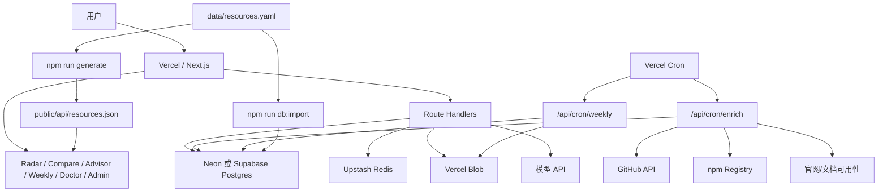

# 小程序雷达 Vercel 生产实施方案

本文档面向“小程序雷达”的真实上线。目标不是继续规划产品概念，而是把当前代码、数据、AI 能力和 Vercel 生态服务串成一套可执行、可验收、可长期运维的实施路径。

## 1. 实施目标

把当前项目部署为一个可公开访问的小程序生态选型工具，并在免费或低成本资源内完成 MVP 闭环。

上线后应具备这些能力：

- Radar：按分类、推荐状态、风险等级、适用场景筛选小程序生态资源。
- Compare：横向对比 Taro、uni-app、原生小程序、MPX、WePY、mpvue 等方案。
- Advisor：基于资源库和证据生成选型建议；没有 AI Key 时使用规则兜底。
- Weekly：定时生成生态周报、RSS 和历史列表。
- Doctor：扫描小程序项目，输出风险、证据、修复建议和推荐资源。
- Admin：查看健康状态、运行日志、集成状态，并维护资源字段。
- API：提供资源、详情、对比、周报、导出和诊断接口。

生产完成定义：

- Vercel Production URL 可公开访问。
- 数据库、Cron、Admin 保护、健康检查和部署验证通过。
- Redis、Blob、AI 可按需启用，并且没有配置时不影响基础站点运行。
- 所有 AI 输出必须能追溯到资源库或证据字段，不能凭空生成结论。

## 2. 技术栈

固定技术选型：

| 模块 | 选型 | 用途 |
| --- | --- | --- |
| Web 框架 | Next.js App Router | 页面、API、Cron 入口、服务端逻辑 |
| 语言 | TypeScript | 资源模型、API、脚本和验证逻辑 |
| 样式 | Tailwind CSS | 雷达页、详情页、后台和表单界面 |
| UI | shadcn 风格组件 | Card、Badge、Button、Form、Table、Dialog |
| 图标 | lucide-react | 导航、状态、操作按钮 |
| 部署 | Vercel | Production、Preview、Functions、Cron、Analytics |
| ORM | Drizzle ORM | Postgres schema、迁移和类型安全查询 |
| 主数据库 | Neon Postgres 或 Supabase Postgres | 资源、评分、采集信号、周报、运行日志 |
| 缓存/限流 | Upstash Redis | Advisor 缓存、公开接口限流、Cron 任务锁 |
| 对象存储 | Vercel Blob | 周报快照、Doctor 报告、导出文件 |
| AI | 服务端模型 API | 摘要、Advisor、Weekly 导语、Doctor 总结 |

默认推荐组合：

- MVP 默认：`Next.js + Tailwind CSS + shadcn + Drizzle + Neon Postgres + Vercel`。
- 如果后续要用户登录、收藏、订阅、后台协作：切到或补充 `Supabase`。
- 如果只追求最高免费读写额度，并能接受 SQLite/libSQL：评估 `Turso`，但当前 Postgres 路线不优先改。
- `Vercel KV` 新项目按 `Upstash Redis` 规划。
- `Vercel Blob` 只存对象和快照，不作为主数据库。

## 3. 总体架构



降级策略：

- 无数据库：页面和 API 回退 `public/api/resources.json`。
- 无 AI Key：Advisor、AI 摘要、Doctor 总结使用规则结果。
- 无 Redis：使用应用内限流和无分布式锁降级，生产建议补齐 Redis。
- 无 Blob：周报、Doctor 报告和导出仍可返回内容，只是不上传快照。
- Cron 不可用：通过脚本手动运行采集和周报。

## 4. 数据实施方案

保留 `data/resources.yaml` 作为人工维护入口，同时用 Postgres 承载线上查询和自动化结果。

核心表：

| 表 | 作用 |
| --- | --- |
| `resources` | 资源基础信息、分类、状态、风险、摘要、适用场景 |
| `resource_signals` | GitHub、npm、官网、文档等采集信号 |
| `resource_scores` | 规则评分、维护状态、风险等级、评分理由 |
| `resource_ai_summaries` | 规则或模型生成摘要、风险说明、证据引用 |
| `resource_alternatives` | 资源之间的替代、迁移和同类推荐关系 |
| `advisor_sessions` | Advisor 问题、回答摘要、命中资源、时间 |
| `weekly_reports` | 周报标题、周期、结构化数据、Markdown、Blob URL |
| `operation_logs` | Cron、Admin、Weekly、采集任务运行记录 |

数据流：

1. 人工维护 `data/resources.yaml`。
2. `npm run generate` 生成 README 和静态资源 JSON。
3. `npm run db:migrate` 建表。
4. `npm run db:import` 将 YAML 幂等导入数据库。
5. API 优先读数据库，失败或未配置时回退静态 JSON。
6. Cron 写入采集信号、评分、周报和运行日志。
7. Blob 只存报告、周报和导出文件，数据库只存 URL、hash 和元数据。

## 5. AI 实施方案

AI 是增强能力，不是事实来源。

第一阶段先保持无 Key 可用：

- Advisor 使用规则型选型逻辑。
- AI 摘要使用资源字段和评分规则生成。
- Weekly 使用结构化信号生成周报。
- Doctor 根据扫描规则输出总结和修复建议。

用户确认并配置 `OPENAI_API_KEY` 后，再启用真实模型：

- 资源摘要：生成一句话介绍、适用场景、风险说明。
- Advisor：基于团队背景、项目场景、资源库和证据生成选型建议。
- Weekly：把结构化变化总结成自然语言周报导语。
- Doctor：把扫描结果整理成更可读的迁移和修复建议。

强制约束：

- 模型调用只发生在服务端 Route Handler 或脚本中。
- Key 不允许进入 `NEXT_PUBLIC_*`、前端 bundle、public 产物或日志。
- 输出必须包含资源引用或证据引用。
- 输出引用的 URL 必须来自资源库或证据字段。
- 校验失败时不写入数据库、不写入 Blob、不进入公开页面。
- 相同资源摘要、相同 Advisor 问题和周报按周期缓存。

## 6. Vercel 免费资源使用评估

MVP 的访问模式是公开页面浏览、少量 API 查询、每日采集、每周周报和少量 Advisor 问答。Vercel Hobby 免费资源整体够用，主要风险在 AI 成本、数据库容量、Cron 耗时、Blob 操作数和公开接口滥用。

可用能力：

| Vercel 能力 | 用法 | 判断 |
| --- | --- | --- |
| Production / Preview Deployments | 生产站点和每次提交预览 | 必用 |
| CDN / ISR | Radar、详情页、周报页静态化或缓存 | 必用 |
| Functions / Route Handlers | API、Advisor、Doctor、Admin、Cron | 必用 |
| Vercel Cron | 每日采集、每周周报 | 可用，按低频设计 |
| Analytics | 看热门资源、页面和入口 | 建议使用 |
| Speed Insights | 观察页面性能 | 建议使用 |
| Vercel Blob | 周报、Doctor 报告、导出快照 | 建议使用 |
| Edge Config | 功能开关、公告、模型开关 | 可选 |
| Firewall / Rate Limiting | 保护 Advisor、Admin、Cron | 可评估，MVP 先用应用层限流 |
| Marketplace | 接入 Neon、Supabase、Upstash 等 | 必用 |

数据库与存储建议：

| 服务 | 适合用途 | 项目建议 |
| --- | --- | --- |
| Neon Postgres | Postgres 主库、Drizzle 迁移、Preview 分支 | 默认推荐 |
| Supabase Postgres | Postgres、Auth、Storage、后台管理 | 产品化增强时推荐 |
| Turso | 读多写少、追求更高免费读写额度 | 暂不作为默认路线 |
| Upstash Redis | 缓存、限流、Cron 锁 | 建议接入 |
| Vercel Blob | 报告、周报、导出文件 | 建议接入 |

控制策略：

- 公开页面尽量静态化或走缓存。
- `/api/resources` 默认分页，只返回摘要字段。
- 详情页再加载完整证据、评分和替代方案。
- Cron 分批采集，避免一次任务抓取全部资源。
- Redis 缓存 Advisor 结果，并做 IP 级限流。
- Weekly 和 Doctor 大文本放 Blob。
- `operation_logs` 默认保留 30 天，避免数据库无限增长。

## 7. 分阶段实施计划

### 阶段 0：本地基线冻结

目标：确认项目在无外部服务时也能完整运行。

任务：

- 固化 Next.js、Tailwind CSS、shadcn 风格组件和 Vercel 配置。
- 确认静态 JSON 降级、数据库读取、规则 AI 三条链路。
- 确认 `.env.example` 覆盖生产变量。
- 跑完本地检查。

验收命令：

```bash
npm run check
npm run deploy:check
npm run mvp:check
npm run build
```

### 阶段 1：Vercel 静态降级版上线

目标：先部署不依赖外部服务的版本。

任务：

- 在 Vercel 导入 GitHub 仓库。
- Node.js 使用 20 或更高版本。
- Build Command 使用 `npm run build`。
- 先不配置数据库、Redis、Blob、AI Key。
- 获取 Production URL。

验收：

- `/`、`/radar`、`/compare`、`/advisor`、`/weekly`、`/doctor`、`/admin` 可访问。
- `/api/health` 正常。
- `/api/resources` 能返回静态资源。

验证命令：

```bash
npm run vercel:preflight -- <production-url>
npm run deployment:verify -- <production-url>
```

### 阶段 2：Postgres 数据库上线

目标：资源和自动化数据进入线上数据库。

任务：

- 在 Vercel Marketplace 创建 Neon 或 Supabase。
- 配置 `DATABASE_URL`。
- 执行迁移和导入。
- 验证资源 API 从数据库读取。

命令：

```bash
npm run db:migrate
npm run db:import
EXPECT_DATABASE=1 npm run db:verify
EXPECT_DATABASE=1 npm run deployment:verify -- <production-url>
```

验收：

- `resources` 表有数据。
- 重复导入不产生重复资源。
- 详情页能展示数据库资源、评分、替代方案和更新时间线。
- 未配置数据库时仍能回退静态 JSON。

### 阶段 3：Cron、GitHub 采集和评分上线

目标：让资源维护状态和风险等级持续更新。

任务：

- 配置 `CRON_SECRET`。
- 配置 `GITHUB_TOKEN`。
- Vercel Cron 指向 `/api/cron/enrich`。
- 先 dry-run 验证授权链路。
- 再小批量正式采集。

验收：

- 未授权 Cron 返回 401。
- 授权 dry-run 不写数据库和 Blob。
- 正式采集写入 `resource_signals`、`resource_scores`、`operation_logs`。
- 单个资源失败不会中断整批。

验证命令：

```bash
EXPECT_GITHUB=1 npm run integrations:verify
VERIFY_CRON_SECRET=<CRON_SECRET> npm run deployment:verify -- <production-url>
```

### 阶段 4：Upstash Redis 缓存、限流和任务锁

目标：保护公开接口和定时任务。

任务：

- 创建 Upstash Redis。
- 配置 `UPSTASH_REDIS_REST_URL`/`UPSTASH_REDIS_REST_TOKEN`，或使用 Vercel Marketplace 自动注入的 `KV_REST_API_URL`/`KV_REST_API_TOKEN`。
- 验证 Advisor 缓存和限流。
- 验证 Cron 锁，避免任务重叠。

命令：

```bash
EXPECT_UPSTASH_REDIS=1 npm run integrations:verify
```

验收：

- 高频 Advisor 请求会被限制。
- 相同问题可命中缓存。
- Cron 锁冲突返回 409。
- Redis 不可用时有降级路径。

### 阶段 5：Vercel Blob 和 Weekly 快照

目标：把周报、Doctor 报告和导出文件从数据库大文本中拆出去。

任务：

- 配置 `BLOB_READ_WRITE_TOKEN`。
- 验证 Blob 写入和删除。
- Vercel Cron 指向 `/api/cron/weekly`。
- 生成 Weekly Markdown、JSON、RSS。
- 将周报和报告快照上传 Blob。

命令：

```bash
EXPECT_BLOB=1 VERIFY_BLOB_WRITE=1 npm run integrations:verify
```

验收：

- `/weekly` 可展示最新周报和历史列表。
- `/weekly.xml` 可访问。
- Blob 中有周报或 Doctor 报告快照。
- 数据库只保存 Blob URL、hash 和元数据。

### 阶段 6：Doctor 体检闭环

目标：让项目区别于普通资源列表。

任务：

- 固化 `miniprogram-radar doctor <project-root>` CLI。
- Web Doctor 展示扫描结果、风险、修复建议和推荐资源。
- 支持识别原生、Taro、uni-app、MPX、WePY、mpvue。
- 检查依赖、框架、配置、`.env*` 与 `.gitignore`。
- 可选上传报告到 Blob。

验收：

- 报告包含等级、优先级、证据、修复建议和推荐资源。
- 不读取、不输出密钥内容。
- 高风险依赖能链接回 Radar 替代资源。

### 阶段 7：真实 AI 接入

目标：在用户确认后启用模型能力。

任务：

- 确认是否使用 `OPENAI_API_KEY`。
- 只在 Vercel 服务端环境变量中配置。
- 为资源摘要、Advisor、Weekly、Doctor 接入模型增强。
- 保留规则兜底。
- 对输出做结构校验和证据校验。

验收：

- `npm run secret-exposure:test` 通过。
- 前端 bundle 和 public 产物不含 Key。
- 模型输出引用已存在资源和证据。
- 模型失败时返回规则结果。

### 阶段 8：Admin 运维闭环

目标：让资源维护、运行状态和线上问题可被持续管理。

任务：

- 配置 `ADMIN_TOKEN`。
- Admin 展示健康状态、资源规模、集成状态和运行日志。
- 支持维护资源状态、维护状态、风险等级和摘要。
- 维护操作写入 `operation_logs`。

验收：

- 未授权 Admin API 返回 401。
- 非法 payload 返回 400。
- 授权后可更新数据库资源。
- 操作记录可追踪。

## 8. 环境变量清单

首批建议配置：

```text
DATABASE_URL
CRON_SECRET
ADMIN_TOKEN
GITHUB_TOKEN
SITE_URL
NEXT_PUBLIC_SITE_URL
```

按能力启用：

```text
OPENAI_API_KEY
BLOB_READ_WRITE_TOKEN
UPSTASH_REDIS_REST_URL
UPSTASH_REDIS_REST_TOKEN
KV_REST_API_URL
KV_REST_API_TOKEN
OPERATION_LOG_RETENTION_DAYS
VERCEL_TOKEN
VERCEL_PROJECT_ID
VERCEL_ORG_ID
```

变量说明：

| 变量 | 必需性 | 用途 |
| --- | --- | --- |
| `DATABASE_URL` | 接入数据库后必需 | Postgres 连接串 |
| `CRON_SECRET` | 建议必需 | 保护 `/api/cron/*` |
| `ADMIN_TOKEN` | 建议必需 | 保护 `/admin` 和 `/api/admin/*` |
| `GITHUB_TOKEN` | 建议必需 | 提高 GitHub API 采集额度 |
| `SITE_URL` | 建议配置 | 生产站点根地址 |
| `NEXT_PUBLIC_SITE_URL` | 建议配置 | 前端可见 canonical 站点地址 |
| `OPENAI_API_KEY` | 可选 | 启用真实 AI |
| `BLOB_READ_WRITE_TOKEN` | 可选 | 启用 Blob 上传 |
| `UPSTASH_REDIS_REST_URL` | 可选 | Redis REST 地址 |
| `UPSTASH_REDIS_REST_TOKEN` | 可选 | Redis REST Token |
| `KV_REST_API_URL` | 可选 | Vercel Marketplace Upstash Redis REST 地址别名 |
| `KV_REST_API_TOKEN` | 可选 | Vercel Marketplace Upstash Redis REST Token 别名 |
| `OPERATION_LOG_RETENTION_DAYS` | 可选 | 运行日志保留天数，默认 30 |
| `VERCEL_TOKEN` | 可选 | 非交互 Vercel CLI 和 CI preflight |
| `VERCEL_PROJECT_ID` | 可选 | CI 中识别 Vercel 项目 |
| `VERCEL_ORG_ID` | 可选 | CI 中识别 Vercel 团队或账号 |

安全规则：

- 不要创建 `NEXT_PUBLIC_OPENAI_API_KEY`。
- 不要把任何 Secret 写入 README、public JSON 或客户端组件。
- 生产日志不要输出完整连接串和 Token。
- GitHub Actions 中 Secret 放 `Secrets`，非敏感开关放 `Variables`。

## 9. 上线 Runbook

### 9.1 本地确认

```bash
npm run check
npm run deploy:check
npm run mvp:check
npm run build
```

### 9.2 创建 Vercel 项目

1. 在 Vercel 导入 GitHub 仓库。
2. 确认 Framework Preset 是 Next.js。
3. 确认 Node.js 版本为 20 或更高。
4. 先部署静态降级版。
5. 记录 Production URL。

### 9.3 部署前置检查

```bash
npm run vercel:preflight -- <production-url>
```

严格模式：

```bash
EXPECT_VERCEL_DEPLOY=1 npm run vercel:preflight -- <production-url>
```

### 9.4 生产初始化计划

先只看计划：

```bash
npm run production:bootstrap -- <production-url>
```

外部服务和环境变量都配置后再执行：

```bash
npm run production:bootstrap -- <production-url> execute expect-vercel-deploy expect-mvp expect-site-url expect-database expect-github expect-blob expect-redis
```

如果真实 AI 暂缓，不要加 `expect-openai`。确认启用 AI 后再追加：

```bash
npm run production:bootstrap -- <production-url> execute expect-vercel-deploy expect-mvp expect-site-url expect-database expect-github expect-blob expect-redis expect-openai
```

### 9.5 线上验证

```bash
npm run deployment:verify -- <production-url>
```

带 Cron dry-run：

```bash
VERIFY_CRON_SECRET=<CRON_SECRET> npm run deployment:verify -- <production-url>
```

严格集成验证：

```bash
EXPECT_DATABASE=1 EXPECT_GITHUB=1 EXPECT_BLOB=1 EXPECT_UPSTASH_REDIS=1 npm run integrations:verify
```

## 10. GitHub Actions 验收

生产验证 workflow 应覆盖：

- `npm run vercel:preflight -- <production-url>`
- `npm run mvp:check -- <production-url>`
- `npm run integrations:verify`
- `npm run deployment:verify -- <production-url>`

GitHub Variables 建议：

```text
EXPECT_VERCEL_DEPLOY
EXPECT_MVP
EXPECT_DATABASE
EXPECT_GITHUB
EXPECT_BLOB
EXPECT_UPSTASH_REDIS
EXPECT_SITE_URL
EXPECT_OPENAI
SITE_URL
NEXT_PUBLIC_SITE_URL
VERCEL_PROJECT_ID
VERCEL_ORG_ID
```

GitHub Secrets 建议：

```text
VERCEL_TOKEN
CRON_SECRET
RADAR_GITHUB_TOKEN
BLOB_READ_WRITE_TOKEN
UPSTASH_REDIS_REST_URL
UPSTASH_REDIS_REST_TOKEN
KV_REST_API_URL
KV_REST_API_TOKEN
```

收口策略：

- 初次上线只打开 `EXPECT_MVP` 和 `EXPECT_SITE_URL`。
- 数据库稳定后打开 `EXPECT_DATABASE`。
- GitHub、Blob、Redis 接通后分别打开对应期望。
- OpenAI 确认接入后再打开 `EXPECT_OPENAI`。

## 11. 验收标准

本地验收：

- `npm run check` 通过。
- `npm run deploy:check` 通过。
- `npm run mvp:check` 通过或只剩明确的外部服务 warning。
- `npm run build` 通过。
- `npm run secret-exposure:test` 通过。

线上验收：

- Production URL 可访问。
- `/api/health` 正常。
- Radar、Compare、Advisor、Weekly、Doctor、Admin 页面可打开。
- `/api/resources`、`/api/resources/[id]`、`/api/compare`、`/api/weekly`、`/weekly.xml` 正常。
- `sitemap.xml` 和 `robots.txt` 正常。
- Admin、Cron、导出快照接口未授权请求返回 401。
- 数据库、Redis、Blob 按期望接入。
- Cron dry-run 可验证授权链路。
- 如果启用 AI，模型输出必须通过证据校验。

MVP 完成标准：

- 站点不是资源列表换皮，而是具备状态、风险、证据、替代方案和 Advisor 的工具。
- 资源库可以从 YAML 导入数据库，并保留静态降级。
- 采集和评分可自动运行。
- 周报可生成。
- Doctor 可输出报告。
- 生产验证命令通过。

## 12. 运营观察指标

技术指标：

- Vercel Functions 调用量、错误率、耗时。
- Cron 成功率、耗时、失败资源数。
- 数据库容量、连接数、慢查询。
- Redis 命令数、缓存命中率、限流次数。
- Blob 存储量、操作数、流量。
- 构建成功率和 Preview 部署耗时。

产品指标：

- `/radar` 访问量和筛选条件。
- 资源详情页访问排名。
- Advisor 提问数量、命中资源和缓存命中率。
- Weekly 访问量和 RSS 订阅。
- Doctor 报告生成次数。
- 高风险资源被查看和被替代的频率。

## 13. 风险与处理

| 风险 | 表现 | 处理 |
| --- | --- | --- |
| 产品仍像列表 | 页面只有链接和分类 | 强化状态、风险、证据、替代方案、Advisor |
| AI 编造结论 | 引用不存在资源或 URL | 证据校验失败就拒绝持久化 |
| AI 成本失控 | Advisor 被刷 | Redis 限流、缓存、热门问题预生成 |
| 数据库容量不足 | 日志、摘要、报告持续增长 | 报告进 Blob，日志设置保留期 |
| Cron 超时 | 一次采集太多资源 | 分批、limit、失败重试、任务锁 |
| GitHub API 受限 | 采集失败或被限流 | 配置 Token，降低频率，优先核心资源 |
| Blob 操作数过高 | 高频上传小对象 | 周报和报告按周期写，避免每次访问写入 |
| Redis 命令数过高 | 公开接口被刷 | 应用层限流前置，缓存 TTL 合理设置 |
| 密钥泄露 | 前端或日志出现 Key | 服务端读取、日志脱敏、密钥扫描 |
| 免费额度变化 | 服务商调整计划 | 上线前复核控制台，保留降级方案 |

## 14. 推荐上线顺序

1. 本地验证全部通过。
2. Vercel 静态降级版上线。
3. 配置 `SITE_URL` 和 `NEXT_PUBLIC_SITE_URL`。
4. 接入 Neon 或 Supabase，迁移并导入资源。
5. 配置 `CRON_SECRET`、`ADMIN_TOKEN`、`GITHUB_TOKEN`。
6. 验证采集、评分和运行日志。
7. 接入 Upstash Redis。
8. 接入 Vercel Blob。
9. 观察一周免费额度和错误率。
10. 用户确认后配置 `OPENAI_API_KEY`，启用真实 AI。
11. 再考虑用户系统、收藏、订阅、团队报告和商业化能力。

## 15. 当前下一步

当前代码侧已经具备较完整的 MVP 骨架，下一步重点是外部服务和生产验证：

1. 在 Vercel 创建并部署项目。
2. 获取 Production URL。
3. 执行 `npm run vercel:preflight -- <production-url>`。
4. 创建 Neon 或 Supabase，配置 `DATABASE_URL`。
5. 执行 `npm run db:migrate` 和 `npm run db:import`。
6. 配置 `CRON_SECRET`、`ADMIN_TOKEN`、`GITHUB_TOKEN`。
7. 执行 `VERIFY_CRON_SECRET=<CRON_SECRET> npm run deployment:verify -- <production-url>`。
8. 配置 Upstash Redis 和 Vercel Blob。
9. 用户确认后再接真实 AI。
